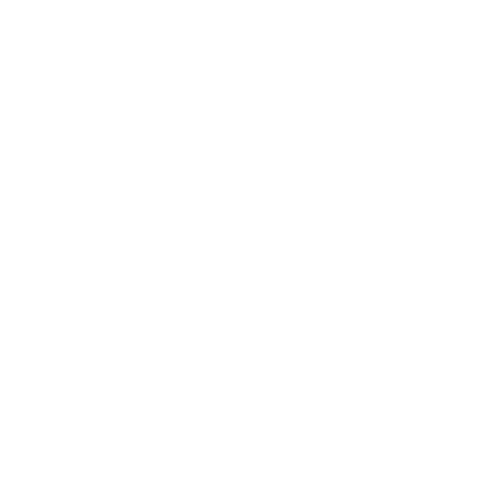
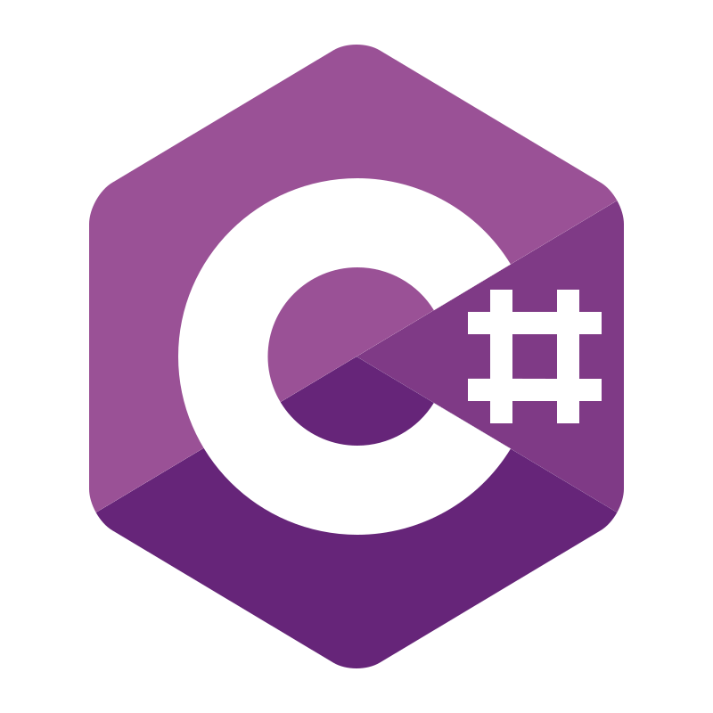
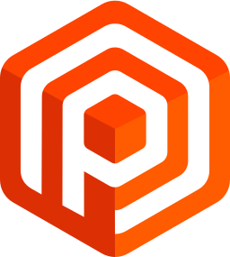
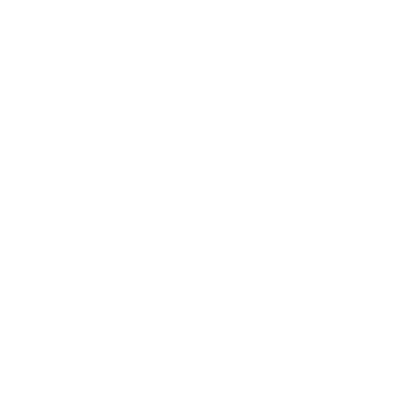
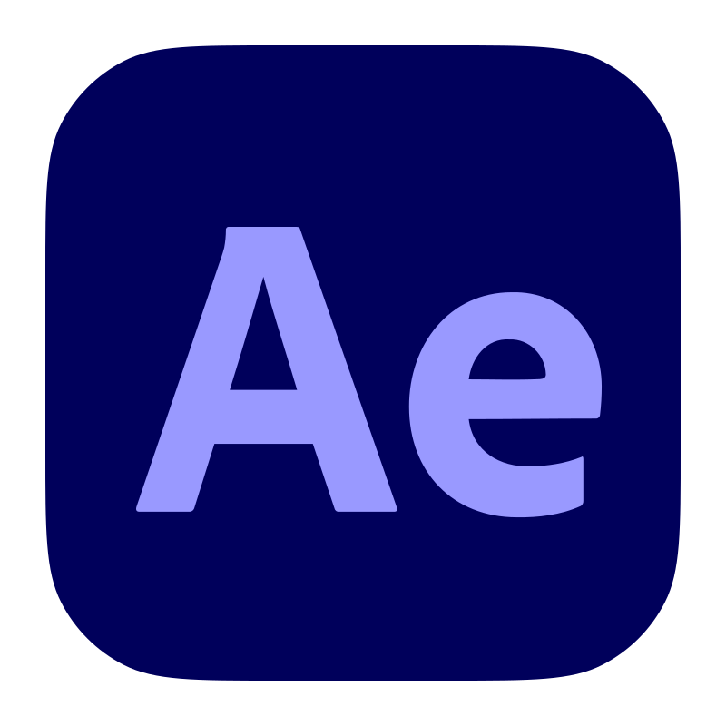
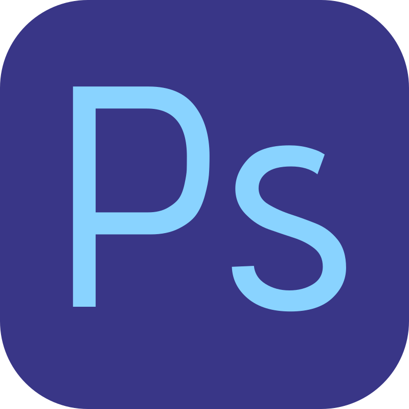

# Hello everyone! 👋

`Console.Writeline("Hello world!");`

## Who am I?
My name is **Francisco Jesús Huerta Hervás (alias FranForge)**, and I’m a developer passionate about videogames. I’ve been working with Unity since 2022, and I have published games on Google Play, Steam, and Nintendo Switch. The Switch release was a big challenge, but I’m very proud of having successfully completed the port.

## Professional Projects
- The Sky Project - Enthariel Games (Not released) | Unity
- Animal Strikers - Enthariel Games ([Switch](https://ec.nintendo.com/NZ/en/titles/70010000092953)) | Unity
- Luminaria: Dark Echoes - Enthariel Games ([Steam](https://store.steampowered.com/app/2690580/Luminaria_Dark_Echoes/), [Switch](https://www.nintendo.com/es-es/Juegos/Programas-descargables-Nintendo-Switch/Luminaria-Dark-Echoes-2837089.html), [PS5](https://store.playstation.com/es-es/concept/10013956)) | Unity
- Confinio: Reality Prison - Enthariel Games ([Steam](https://store.steampowered.com/app/3030830/Confinio_Reality_Prison/?l=spanish)) | Unity

You can see additional personal projects [here](https://www.franforge.es/en/projects/all.html).

## Technical Skills
- Unity 
- Unreal 
- C# 
- C++ 
- HTML 
- CSS 
- JS 
- Plastic SCM 
- Github 
- Blender 
- Adobe Premiere 
- Adobe After Effects 
- Adobe Photoshop 

## What am I doing now?
I’m currently expanding my skills in Unity and Unreal with personal projects, and even web development through my personal website, franforge.es. The repository is available on GitHub, so it can also be viewed directly from the code lol.

## Additional Information
You can read more about me at [my website](franforge.es).
